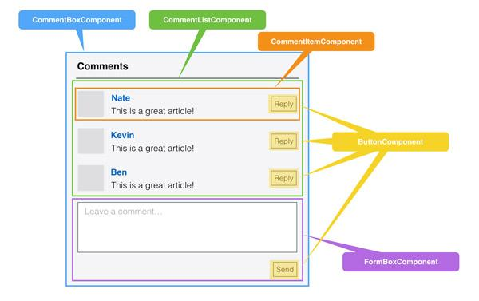

# reactjs

- 代码 https://github.com/facebook/react
- 入门（中文） http://reactjs.cn/react/docs/getting-started.html


React 仅仅是个 view 层！

基于HTML的前端界面开发正变得越来越复杂，其本质问题基本都可以归结于如何将来自于服务器端或者用户输入的动态数据高效的反映到复杂的用户界面上。而来自Facebook的React框架正是完全面向此问题的一个解决方案，按官网描述，其出发点为：用于开发数据不断变化的大型应用程序（Building large applications with data that changes over time）。相比传统型的前端开发，React开辟了一个相当另类的途径，实现了前端界面的高效率高性能开发。

首先，对于React，有一些认识误区，这里先总结一下：

- React不是一个完整的MVC框架，最多可以认为是MVC中的V（View），甚至React并不非常认可MVC开发模式；
- React的服务器端Render能力只能算是一个锦上添花的功能，并不是其核心出发点，事实上React官方站点几乎没有提及其在服务器端的应用；
- 有人拿React和Web Component相提并论，但两者并不是完全的竞争关系，你完全可以用React去开发一个真正的Web Component；
- React不是一个新的模板语言，JSX只是一个表象，没有JSX的React也能工作。

重要事情说3遍

React 仅仅是个 view 层！

React 仅仅是个 view 层！

React 仅仅是个 view 层！

## 基本概念

### 组件化

虚拟DOM(virtual-dom)不仅带来了简单的UI开发逻辑，同时也带来了组件化开发的思想，所谓组件，即封装起来的具有独立功能的UI部件。React推荐以组件的方式去重新思考UI构成，将UI上每一个功能相对独立的模块定义成组件，然后将小的组件通过组合或者嵌套的方式构成大的组件，最终完成整体UI的构建。例如，Facebook的instagram.com整站都采用了React来开发，整个页面就是一个大的组件，其中包含了嵌套的大量其它组件，大家有兴趣可以看下它背后的代码。

如果说MVC的思想让你做到视图-数据-控制器的分离，那么组件化的思考方式则是带来了UI功能模块之间的分离。我们通过一个典型的Blog评论界面来看MVC和组件化开发思路的区别。

对于MVC开发模式来说，开发者将三者定义成不同的类，实现了表现，数据，控制的分离。开发者更多的是从技术的角度来对UI进行拆分，实现松耦合。

对于React而言，则完全是一个新的思路，开发者从功能的角度出发，将UI分成不同的组件，每个组件都独立封装。

在React中，你按照界面模块自然划分的方式来组织和编写你的代码，对于评论界面而言，整个UI是一个通过小组件构成的大组件，每个组件只关心自己部分的逻辑，彼此独立。



React认为一个组件应该具有如下特征：

（1）可组合（Composeable）：一个组件易于和其它组件一起使用，或者嵌套在另一个组件内部。如果一个组件内部创建了另一个组件，那么说父组件拥有（own）它创建的子组件，通过这个特性，一个复杂的UI可以拆分成多个简单的UI组件；

（2）可重用（Reusable）：每个组件都是具有独立功能的，它可以被使用在多个UI场景；

（3）可维护（Maintainable）：每个小的组件仅仅包含自身的逻辑，更容易被理解和维护；

（4）可测试（Testable）：因为每个组件都是独立的，那么对于各个组件分别测试显然要比对于整个UI进行测试容易的多。

### 什么是JSX？

在用React写组件的时候，通常会用到JSX语法，粗看上去，像是在Javascript代码里直接写起了XML标签，实质上这只是一个语法糖，每一个XML标签都会被JSX转换工具转换成纯Javascript代码，当然你想直接使用纯Javascript代码写也是可以的，只是利用JSX，组件的结构和组件之间的关系看上去更加清晰

更多见 http://my.oschina.net/leogao0816/blog/379487

### Virtual DOM

Virtual DOM是reactjs的最核心概念，我拷贝一段来说明它

在Web开发中，我们总需要将变化的数据实时反应到UI上，这时就需要对DOM进行操作。而复杂或频繁的DOM操作通常是性能瓶颈产生的原因（如何进行高性能的复杂DOM操作通常是衡量一个前端开发人员技能的重要指标）。React为此引入了虚拟DOM（Virtual DOM）的机制：在浏览器端用Javascript实现了一套DOM API。基于React进行开发时所有的DOM构造都是通过虚拟DOM进行，每当数据变化时，React都会重新构建整个DOM树，然后React将当前整个DOM树和上一次的DOM树进行对比，得到DOM结构的区别，然后仅仅将需要变化的部分进行实际的浏览器DOM更新。而且React能够批处理虚拟DOM的刷新，在一个事件循环（Event Loop）内的两次数据变化会被合并，例如你连续的先将节点内容从A变成B，然后又从B变成A，React会认为UI不发生任何变化，而如果通过手动控制，这种逻辑通常是极其复杂的。尽管每一次都需要构造完整的虚拟DOM树，但是因为虚拟DOM是内存数据，性能是极高的，而对实际DOM进行操作的仅仅是Diff部分，因而能达到提高性能的目的。这样，在保证性能的同时，开发者将不再需要关注某个数据的变化如何更新到一个或多个具体的DOM元素，而只需要关心在任意一个数据状态下，整个界面是如何Render的。


说那么多你可能都没明白，上例子

## helloworld

```
bower install --save react
```

创建并编写index.html

```
<!DOCTYPE html>
<html>
  <head>
    <!-- The core React library -->
    <script src="bower_components/react/react.js"></script>
    <!-- In-browser JSX transformer, remove when pre-compiling JSX. -->
    <script src="bower_components/react/JSXTransformer.js"></script>
  </head>
  <body>
    <div id="container"></div>
    <script type="text/jsx" src="helloworld.jsx">
  </body>
</html>
```

编写helloworld.jsx

```
var HelloMessage = React.createClass({
  render: function() {
    return <div>Hello {this.props.name}</div>;
  }
});

React.render(
  <HelloMessage name="John" />,
  document.getElementById('container')
);
```

然后使用http-server启动一个http服务（如果没有http-server，请[sudo]npm install -g http-server）

    http-server .  -p 8044 -o

访问

    http://127.0.0.1:8044/
    

首先，这是一种 HTML-like 的语法，叫jsx，可以理解成coffee，typescript之类的，需要编译

核心就是React.render，说明这个组件放在什么地方，比如上面的例子就是

    <div id='container'>
      ...
    </div>


这样页面就可以拆分成n个小块，每块各自为政，即所谓的组件化（也就积木一样）

注意：

1. 对于内联与HTML中的代码或者是未经过转化的外部文件，在script标签中要加上type="text/jsx"，并引入JSXTransformer.js文件即可
1. 上面使用的是helloworld.jsx，这是为了演示用的，实际reactjs建议的后缀是js
1. 使用http-server可以防止chrome的本地资源跨域问题

开发阶段这样写没问题，但上线的产品环境是不能这样写的，见helloworld2

## helloworld2（使用react-tools编译jsx）

复制helloworld为helloworld2，创建dist目录存放编译后的jsx文件，把helloworld.jsx放到src/helloworld.jsx,同时修改index.html里的链接

    <script type="text/jsx" src="dist/helloworld.js">

至此准备工作就做完了，下面开始介绍使用react-tools来编译jsx，安装后就会jsx命令，我们主要靠的就是jsx来编译的

```
➜  reactjs git:(master) ✗ npm install -g react-tools
➜  reactjs git:(master) ✗ jsx --help

  Usage: jsx [options] <source directory> <output directory> [<module ID> [<module ID> ...]]

  Options:

    -h, --help                               output usage information
    -V, --version                            output the version number
    -c, --config [file]                      JSON configuration file (no file or - means STDIN)
    -w, --watch                              Continually rebuild
    -x, --extension <js | coffee | ...>      File extension to assume when resolving module identifiers
    --relativize                             Rewrite all module identifiers to be relative
    --follow-requires                        Scan modules for required dependencies
    --use-provides-module                    Respect @providesModules pragma in files
    --cache-dir <directory>                  Alternate directory to use for disk cache
    --no-cache-dir                           Disable the disk cache
    --source-charset <utf8 | win1252 | ...>  Charset of source (default: utf8)
    --output-charset <utf8 | win1252 | ...>  Charset of output (default: utf8)
    --harmony                                Turns on JS transformations such as ES6 Classes etc.
    --target [version]                       Specify your target version of ECMAScript. Valid values are "es3" and "es5". The default is "es5". "es3" will avoid uses of defineProperty and will quote reserved words. WARNING: "es5" is not properly supported, even with the use of es5shim, es5sham. If you need to support IE8, use "es3".
    --strip-types                            Strips out type annotations.
    --es6module                              Parses the file as a valid ES6 module. (Note that this means implicit strict mode)
    --non-strict-es6module                   Parses the file as an ES6 module, except disables implicit strict-mode. (This is useful if you're porting non-ES6 modules to ES6, but haven't yet verified that they are strict-mode safe yet)
    --source-map-inline                      Embed inline sourcemap in transformed source
```

安装完成后

```
➜  helloworld2 git:(master) ✗ jsx src/ dist/ -w
["helloworld"]
``` 

上面的`-w`是watch的意思，就是当src目录里的任何文件变动，就会重新编译，和gulp-watch是类似的。

然后执行

    http-server .  -p 8045 -o


访问

    http://127.0.0.1:8045/


## helloworld3（使用gulp-react编译jsx）

复制helloworld2为helloworld3


https://github.com/sindresorhus/gulp-react

安装

    npm install --save gulp-react

创建gulpfile.js

```
var gulp = require('gulp');
var react = require('gulp-react');
 
gulp.task('jsx', function () {
    return gulp.src('src/**')
        .pipe(react())
        .pipe(gulp.dest('dist'));
});

gulp.task('default', ['jsx'], function() {
  gulp.watch('./src/**/*', ['jsx']);
});
```

- 执行`gulp jsx`是编译src下的所有
- 执行`gulp`是编译src下的所有，并当src变动的时候也会重新编译src下的

实际上helloworld2和helloworld3可以实现的功能是一样的，不过gulp更强大更丰富一些，推荐使用gulp。

如果各位不熟悉gulp，参见https://github.com/streakq/js-tools-best-practice/blob/master/doc/Gulp.md


更多jsx集成和构建工具见

- https://github.com/facebook/react/wiki/Complementary-Tools#jsx-integrations
- https://github.com/facebook/react/wiki/Complementary-Tools#build-tools

## helloworld4（使用webpack构建）

webpack是什么？

A bundler for javascript and friends. Packs many modules into a few bundled assets. Code Splitting allows to load parts for the application on demand. Through "loaders" modules can be CommonJs, AMD, ES6 modules, CSS, Images, JSON, Coffeescript, LESS, ... and your custom stuff. 

在 webpack 当中, 所有的资源都被当作是模块, js, css, 图片等，因此webpack当中 js 可以引用 css, css 中可以嵌入图片 dataUrl。对于不同的资源可以使用不同的loader(还有插件机制)，比如coffeescript 用的是 coffee-loader，各种插件参见http://webpack.github.io/docs/list-of-loaders.html


野史

Webpack 是德国开发者 Tobias Koppers 开发的模块加载器
Instagram 工程师认为这个方案很棒, 似乎还把作者招过去了


官方文档

[https://webpack.github.io](https://webpack.github.io)

github上的源码

[https://github.com/webpack/webpack](https://github.com/webpack/webpack)

如果完全不懂，可以看一下webpack入门文档 

[https://webpack.github.io/docs/tutorials/getting-started/](https://webpack.github.io/docs/tutorials/getting-started/)

写了一个helloworld的nodejs程序，具体见examples/webpack/helloworld.md

- examples/webpack/helloworld

下面的demo，根据https://webpack.github.io/docs/tutorials/getting-started/写的代码

- examples/webpack/web1
- examples/webpack/web2
- examples/webpack/loader
- examples/webpack/bindloader

下面开始看看


npm install --save react
npm install --save-dev webpack webpack-dev-server
npm install --save-dev jsx-loader
npm install --save-dev http-server


webpack-dev-server

webpack实践

- watch文件变动，编译
- 使用webpack-dev-server来做分离
- 使用react-hot-loader来livereload

todo


说明：无论是react-tools，还是gulp和webpack只是构建的一种的方式而已，此处罗列这些的目的是想让大家了解大项目构建的可参考方式，至于使用上，可以按照个人习惯。

至此我们完成了4个helloworld，相信大家都已经熟悉了react的几种开发方式和入门例子，下面继续深入reactjs。


## 带有状态的组件

再来个复杂点的，下面给出的是带有状态的组件

见`examples/simple-state/src/state.js`

```
var Input = React.createClass({
  getInitialState: function() {
    return {value: 'Hello!'};
  },
  handleChange: function(event) {
    this.setState({value: event.target.value});
  },
  render: function () {
    var value = this.state.value;
    return (
      <div>
        <input type="text" value={value} onChange={this.handleChange} />
        <p>{value}</p>
      </div>
    );
  }
});

React.render(<Input/>, document.getElementById('container'));

```

然后

    http-server .  -p 8046 -o

访问

    http://127.0.0.1:8046/


是不是有点像双向数据绑定的意思？感兴趣可以看看angular或vuejs或avalon，好多。。。

## 视图相关的3个概念（属性，状态，事件）

- Props（属性，就是element上的attrs，换个名字property，变成复数，即props）
- State（写过view组件的基本都会知道，按钮有三态，Normal，Highlight，Selected，包括extjs，jquery里的大部分ui框架都是有状态的。）
- Event（其实还应该算一个就是dom事件，上面的例子就把onChange的handler编译后的handleChange方法，这要感谢jsx）

回顾一下之前的代码

属性部分

    return <div>Hello {this.props.name}</div>;
    
状态部分

    var value = this.state.value;
    
事件绑定

    <input type="text" value={value} onChange={this.handleChange} />

了解了上面这些，就可以写代码了，因为

- 属性，解决了view的定义问题，即语义描述
- 状态，是view的有穷状态机，根据状态决定ui和行为
- 事件，是view里元素的行为

单独的view的话，实际上上面的东西已经足够了，但是往往我们用的时候是view和viewController一起用的。

但reactjs里并没有却分这个，也就是说view和controller都在组件里，比如ios的但是往往我们用的时候是view和viewController里就有很多生命周期方法，这些在reackjs里也被实现了

## 组件的生命周期

组件的生命周期，另外的名字是状态回调，和上面讲的状态的唯一差别，上面的状态是它里面的元素，而组件的生命周期是它自己

组件的生命周期分成三个状态：

- Mounting：已插入真实 DOM
- Updating：正在被重新渲染
- Unmounting：已移出真实 DOM

React 为每个状态都提供了两种处理函数，will 函数在进入状态之前调用，did 函数在进入状态之后调用，三种状态共计五种处理函数。

- componentWillMount()
- componentDidMount()
- componentWillUpdate(object nextProps, object nextState)
- componentDidUpdate(object prevProps, object prevState)
- componentWillUnmount()

此外，React 还提供两种特殊状态的处理函数。

- componentWillReceiveProps(object nextProps)：已加载组件收到新的参数时调用
- shouldComponentUpdate(object nextProps, object nextState)：组件判断是否重新渲染时调用

## 组件的嵌套

React是基于组件化的开发，那么组件化开发最大的优点是什么？毫无疑问，当然是复用，下面我们来看看React中到底是如何实现组件的复用的，这里我们还写一个例子来说吧，代码如下：

```
var Search = React.createClass({
  render: function() {
    return (
      <div>
         {this.props.searchType}:<input type="text" />
         <button>Search</button>
      </div>
    );
  }
});
var Page = React.createClass({
  render: function() {
    return (
      <div>
         <h1>Welcome!</h1>
         <Search searchType="Title" />
         <Search  searchType="Content" />
      </div>
    );
  }
});
React.render(
  <Page />,
  document.getElementById('container')
);
```

这里我们创建了一个Search组件，然后又创建了一个Page组件，然后我们在Page组件中调用Search组件，并且调用了两次，这里我们通过属性searchType传入值

这里是出于演示，写在一起了，如果是拆开呢？

下面再来看一下上面讨论的组件化吧


## 约定

1、ReactJs是基于组件化的开发，所以最终你的页面应该是由若干个小组件组成的大组件。

2、可以通过属性，将值传递到组件内部，同理也可以通过属性将内部的结果传递到父级组件(留给大家研究)；要对某些值的变化做DOM操作的，要把这些值放到state中。

3、为组件添加外部css样式时，类名应该写成className而不是class;添加内部样式时，应该是style={{opacity: this.state.opacity}}而不是style="opacity:{this.state.opacity};"。

4、组件名称首字母必须大写。

5、变量名用{}包裹，且不能加双引号。

## 实战：Tab

https://github.com/supnate/react-tab-selector

## 推荐阅读

- [React 入门实例教程](http://www.ruanyifeng.com/blog/2015/03/react.html)
- http://segmentfault.com/a/1190000002559219
- http://my.oschina.net/leogao0816/blog/379487
- [颠覆式前端UI开发框架](http://www.infoq.com/cn/articles/subversion-front-end-ui-development-framework-react)

- [JSX in Depth](http://facebook.github.io/react/docs/jsx-in-depth.html)
- [JSX Spread Attributes](http://facebook.github.io/react/docs/jsx-spread.html)
- [If-Else in JSX](http://facebook.github.io/react/tips/if-else-in-JSX.html)
- [JSX Gotchas](http://facebook.github.io/react/docs/jsx-gotchas.html)

webpack

- [https://github.com/petehunt/webpack-howto](https://github.com/petehunt/webpack-howto)

## 最佳实践


### react-hot-boilerplate

Minimal live-editing boilerplate for your next ReactJS project

https://github.com/gaearon/react-hot-boilerplate

### react-hot-loader

React Hot Loader is a plugin for Webpack that allows instantaneous live refresh without losing state while editing React components.

http://gaearon.github.io/react-hot-loader/getstarted/

### ant-design

https://github.com/ant-design

特性

- 提炼自企业级后台产品的交互语言和视觉风格。
- 丰富实用的 React UI 组件。
- 基于 React 的组件化开发模式。
- 背靠 npm 生态圈。
- 基于 webpack 的调试构建方案，支持 ES6。

我们来换一种说法

- 基于react组件化
- 代码在npm里，做到模块化
- 通过webpack构建，更灵活

至于说es几，那只是噱头而已

通过npm，可以更好的和nodejs结合，利用node的生态来扩展，其实bower等也类似，但对package.json不友好，所以我是很看好这种方式的。

以后js大一统，npm就不在只是nodejs package manager的，而是js package manager

另外它的界面设计的很好，模块化的做的也很好，我非常喜欢，唯一的缺点是它对nodejs的版本要求太高了，会让一小部分人不适应的。

## 总结

总结一下，关于reactjs，我没有讲virtual dom，而是主要讲了5个概念

- 属性
- 状态
- 事件
- 生命周期
- 组件嵌套

如果你掌握了这5点，实际上就已经可以很好的使用reactjs了，比如一般view是要和ajax放到一起用的，这时候，只要在组件的生命周期里处理即可，实际上也还是上面的东西，此处就不罗嗦了。

## todo（reactjs高级篇）

- 加点 路由和 数据单向流的 东西吧
- 或者 是服务器端渲染的 数据请求逻辑 什么的
- 如果能用redux 和express做个例子 那就更好了

### Flux

https://github.com/facebook/flux

也许 React 开发中，最让人反感的还是“Flux”。 远比 React 自身混乱。“Flux”这个名字就很让人费解。

Flux 并不是真实存在的。它只是一个概念，而不是个类库。幸运的是，存在一个类库，在某种程度上：

“相比于一个框架，Flux 更像是一种模式。”

呃。一个最不恰当的名字：React 并没有重塑最近 40 年的 UI 体系的知识，也没有为数据管理带来新的概念。

Flux 的概念很简单，view 层触发了一个事件（比如说，用户在文本域中输入了一个姓名），这个事件更新了 model，然后 model 触发了一个事件，view 响应了 model 的事件，使用最新的数据进行渲染。就这样。

这一数据流/解耦观察者模式被设计来保证你的资源总存在于内存/模式中。这是一件好事™。

Flux 的坏处是每个人都会重新发明轮子。由于没有在事件库，model 层，AJAX 层等达成一致，出现了很多种“Flux”的实现方式，并且它们彼此之间相互混杂。

## FAQ

### 很多人最常问的问题：比如和jQuery集成可以吗？

reactjs很小，并没有jq提供的功能，可以说它们是互补的，可以结合着使用

看一下ant-design去，里面就用到了jQuery

### react比angular好用吗？

reactjs是组件化的最佳实践，但angularjs的mvvm等好用功能，它是没有的，所以更好用说不上，姑且可以认为各有千秋吧

### reactjs只是客户端的么？

是有服务器端的react实践的，不过我推荐用客户端的，前后端分离是比较好的，但不排除某种场景使用服务器端react。

- [服务端渲染 React](https://www.npmjs.com/package/react-server-example)

### 我该用 React 吗？

简单回答：是。

详尽的回答：很不幸，是的，在大多数场景中。

下面是为什么要用 React：

对团队开发来说表现的很出色

- 加强了 UI 和 工作流模式 UI 代码的可读和可维护性。
- 组件化的 UI 是 web 开发的趋势，并且你现在应该开始了。

下面是为什么在你选择之前需要再考虑一下：

- 一开始 React 会极大地减慢你的开发。理解props、state以及组件通信如何工作并不是很简单，并且文档信息错综复杂。理论上，这将会被克服，你的整个团队都上道之后，开发速度上就会有一个很大的提升
- React 不支持 IE8 以下的任何浏览器，以后也绝不会
- 如果你的应用/站点不需要频繁的动态页面更新，你可能为了很小的功能而编写大量的代码
- 你会改造很多轮子。React 很年轻，并且因为没有权威的方式来处理事件、组件通信，你必须从零开始创建大量的组件库。你的应用是否有下拉菜单，可调整大小的窗口，或者 lightbox？你同样必须从零开始写这些

以上摘自http://blog.andrewray.me/reactjs-for-stupid-people/

